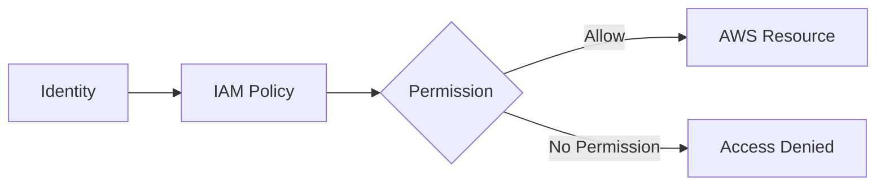
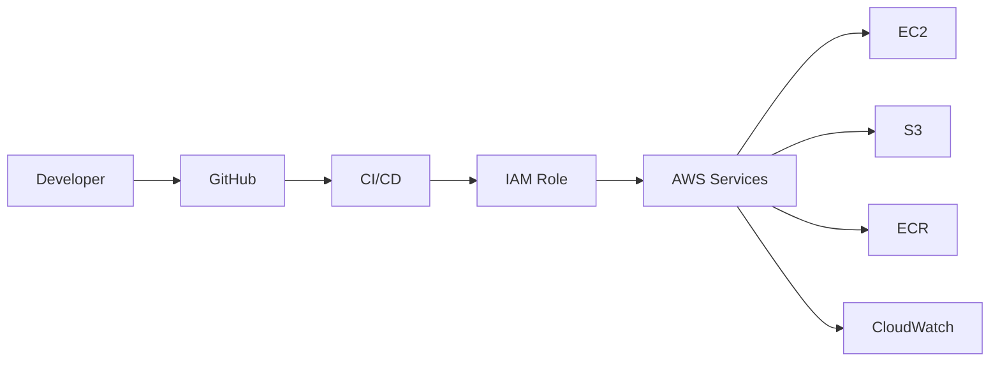

# AWS IAM – Basics

## Introduction

AWS IAM (Identity and Access Management) is a global AWS service used to control **who can access AWS resources and what actions they can perform**.

IAM helps manage:

* Users
* Groups
* Roles
* Policies
* Permissions
* MFA

---

# IAM Basic Architecture

```text
                    AWS IAM
                       |
        +--------------+--------------+
        |              |              |
       User          Group           Role
        |              |              |
        +--------------+--------------+
                       |
                    Policy
                       |
                       v
              AWS Permissions
                       |
                       v
              AWS Resources
```

---

# Authentication vs Authorization

### Authentication

**Who are you?**

Example:

```text
Username + Password
        ↓
      Login
```

### Authorization

**What are you allowed to do?**

Example:

```text
IAM User
   ↓
Policy
   ↓
S3:Read
   ↓
S3 Bucket
```

---

# IAM Components

## 1. IAM User

Represents an individual person or application identity that needs long-term AWS access.

Example:

```text
IAM
 └── User
      └── Developer
```

---

## 2. IAM Group

A collection of IAM users.

Instead of attaching the same permissions to every user:

```text
Developers Group
      |
      +-- User A
      +-- User B
      +-- User C
```

Permissions can be attached to the group.

---

## 3. IAM Role

A role provides **temporary permissions** that can be assumed by users, AWS services, or other trusted entities.

Example:

```text
EC2
 |
 v
IAM Role
 |
 v
S3
```

Roles are heavily used in AWS DevOps.

---

## 4. IAM Policy

A policy is a JSON document that defines permissions.

Example:

```json
{
  "Version": "2012-10-17",
  "Statement": [
    {
      "Effect": "Allow",
      "Action": "s3:GetObject",
      "Resource": "arn:aws:s3:::my-bucket/*"
    }
  ]
}
```

---

# IAM Permission Flow



---

# Root User vs IAM User

| Root User                         | IAM User                 |
| --------------------------------- | ------------------------ |
| Created with AWS account          | Created inside IAM       |
| Full account-level access         | Specific permissions     |
| Should not be used for daily work | Used when appropriate    |
| MFA strongly recommended          | MFA strongly recommended |

### Best Practice

```text
Root User
   ↓
Use only for required account-level tasks

IAM User / Role
   ↓
Daily AWS Operations
```

---

# IAM is Global

IAM resources are **global**.

You don't select an AWS Region when creating:

```text
IAM User
IAM Group
IAM Role
IAM Policy
```

Example:

```text
AWS Account
     |
     +-- IAM
           |
           +-- Users
           +-- Groups
           +-- Roles
           +-- Policies
```

---

# IAM Policy Types

Two important categories:

```text
IAM Policies
│
├── Identity-Based Policy
│
└── Resource-Based Policy
```

### Identity-Based

Attached to:

```text
User
Group
Role
```

### Resource-Based

Attached to resources such as:

```text
S3 Bucket Policy
```

---

# Least Privilege

Give only the permissions required to perform a task.

Bad:

```text
User
 ↓
AdministratorAccess
```

Better:

```text
Developer
   ↓
Required Permissions Only
   ↓
S3 / EC2 / CloudWatch
```

Example:

```text
Application
   |
   +-- s3:GetObject
   +-- s3:PutObject
```

Instead of:

```text
s3:*
```

---

# IAM + AWS DevOps

IAM is used throughout DevOps.



Examples:

```text
EC2 → IAM Role → S3

CI/CD → IAM Role → AWS

Application → IAM Role → AWS Services
```

---

# Practical – Create IAM User

AWS Console:

```text
AWS Console
→ IAM
→ Users
→ Create user
→ Enter username
→ Configure permissions
→ Create user
```

For modern workloads, prefer roles and temporary credentials where possible instead of creating long-lived access keys unnecessarily.

---

# Practical – Create IAM Group

```text
IAM
→ User Groups
→ Create Group
→ Add Users
→ Attach Required Policy
→ Create Group
```

Architecture:

```text
Developers Group
      |
      +-- User 1
      +-- User 2
      +-- User 3
      |
      +-- S3 Read Policy
```

---

# Important IAM Interview Questions

## What is IAM?

IAM is an AWS service used to manage identities and control access to AWS resources.

## Is IAM Regional?

No. IAM is a global AWS service.

## What are the main IAM components?

```text
Users
Groups
Roles
Policies
```

## What is Authentication?

Verifying **who you are**.

## What is Authorization?

Determining **what you are allowed to do**.

## What is an IAM Role?

A role provides temporary permissions that can be assumed by trusted entities.

## What is Least Privilege?

Giving only the minimum permissions required to perform a task.

## Why is IAM important in DevOps?

IAM securely controls access between developers, CI/CD pipelines, applications, and AWS services.

---


