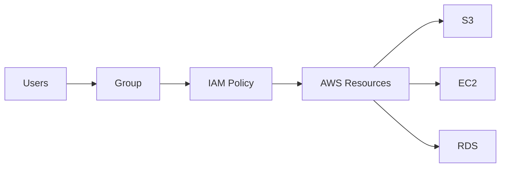

# AWS IAM – Users, Groups and Policies 

## Introduction

IAM Users, Groups, and Policies are used to manage **AWS identities and permissions**.

```text
User
  ↓
Group
  ↓
Policy
  ↓
AWS Resources
```

---

# 1. IAM User

An IAM User represents an individual identity that needs access to AWS.

Example:

```text
IAM
 └── User
      └── developer
```

A user can have:

* Console access
* Programmatic access
* Permissions through policies

---

# 2. IAM Group

A Group is a collection of IAM Users.

Instead of giving permissions individually:

```text
Developers Group
      |
      +-- User 1
      +-- User 2
      +-- User 3
      |
      +-- S3 Read Policy
```

This makes permission management easier.

---

# 3. IAM Policy

A Policy is a JSON document that defines permissions.

It specifies:

```text
Effect
Action
Resource
Condition
```

Example:

```json
{
  "Version": "2012-10-17",
  "Statement": [
    {
      "Effect": "Allow",
      "Action": [
        "s3:GetObject",
        "s3:ListBucket"
      ],
      "Resource": [
        "arn:aws:s3:::my-bucket",
        "arn:aws:s3:::my-bucket/*"
      ]
    }
  ]
}
```

---

# Policy Structure

```text
Policy
│
├── Version
├── Statement
│   ├── Effect
│   ├── Action
│   ├── Resource
│   └── Condition
```

### Effect

```text
Allow / Deny
```

### Action

Defines what operation is allowed.

```text
s3:GetObject
ec2:StartInstances
```

### Resource

Defines which AWS resource is affected.

```text
arn:aws:s3:::my-bucket/*
```

---

# Policy Attachment

Policies can be attached to:

```text
User
Group
Role
```

For multiple users, using a group is usually easier to manage.

---

# Practical – Create IAM User

```text
IAM
→ Users
→ Create user
→ Enter username
→ Configure required access
→ Add to group
→ Create user
```

---

# Practical – Create Group

```text
IAM
→ User groups
→ Create group
→ Enter group name
→ Add users
→ Attach required policy
→ Create group
```

Example:

```text
Developers
    |
    +-- Bindhu
    +-- Developer2
    +-- Developer3
    |
    +-- S3 ReadOnly Policy
```

---

# Best Practices

* Prefer Groups for common permissions.
* Follow Least Privilege.
* Avoid unnecessary AdministratorAccess.
* Review permissions regularly.
* Enable MFA for human users.
* Avoid using the Root User for daily operations.

---

# Important Interview Questions

### What is an IAM User?

An identity representing a person or application that requires AWS access.

### What is an IAM Group?

A collection of IAM users used to manage common permissions.

### What is an IAM Policy?

A JSON document that defines which actions are allowed or denied on AWS resources.

### Can a policy be attached directly to a User?

Yes. Policies can be attached directly to users, groups, or roles.

### Why use Groups?

Groups make permission management easier because common permissions can be managed centrally.

### What is Least Privilege?

Giving only the permissions required to perform a specific task.

---

# Quick Revision



```text
User = Identity
Group = Collection of Users
Policy = Permissions
Least Privilege = Minimum Required Access
```


