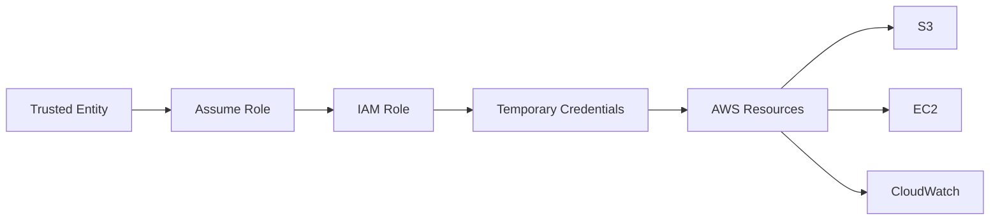
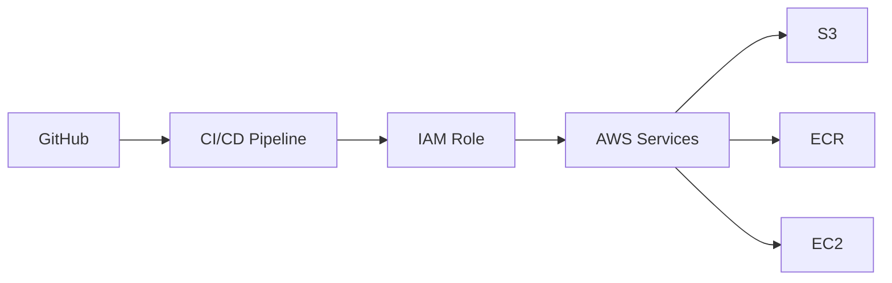

# AWS IAM – Roles
 
## Introduction

An IAM Role is an identity that provides **temporary permissions** to trusted entities such as AWS services, applications, users, or another AWS account.

Roles are widely used in AWS DevOps because they avoid storing long-term access keys.

---

# Basic Architecture

```text
Trusted Entity
      |
      v
  Assume Role
      |
      v
  IAM Role
      |
      v
Temporary Credentials
      |
      v
 AWS Resources
```

---

# IAM Role vs IAM User

| IAM User                  | IAM Role                                     |
| ------------------------- | -------------------------------------------- |
| Long-term identity        | Temporary access                             |
| Can use username/password | Assumed by trusted entity                    |
| Access keys may be used   | Temporary credentials                        |
| Used for human identities | Widely used by AWS services and applications |

---

# Who Can Assume a Role?

An IAM Role can be assumed by:

```text
AWS Services
IAM Users
Another AWS Account
Applications
Federated Users
```

Examples:

```text
EC2 → IAM Role
Lambda → IAM Role
ECS → IAM Role
CI/CD → IAM Role
```

---

# IAM Role Architecture



---

# Two Important Policies

An IAM Role mainly works with two types of policies:

```text
IAM Role
   |
   +-- Trust Policy
   |
   +-- Permissions Policy
```

### 1. Trust Policy

Defines **who can assume the role**.

### 2. Permissions Policy

Defines **what the role is allowed to do**.

---

# Trust Policy Example

Example: Allow EC2 to assume the role.

```json
{
  "Version": "2012-10-17",
  "Statement": [
    {
      "Effect": "Allow",
      "Principal": {
        "Service": "ec2.amazonaws.com"
      },
      "Action": "sts:AssumeRole"
    }
  ]
}
```

Here:

```text
Principal → EC2
Action    → sts:AssumeRole
```

---

# Permissions Policy Example

Example: Allow the role to read objects from S3.

```json
{
  "Version": "2012-10-17",
  "Statement": [
    {
      "Effect": "Allow",
      "Action": [
        "s3:GetObject"
      ],
      "Resource": "arn:aws:s3:::my-bucket/*"
    }
  ]
}
```

---

# Complete Role Flow

```text
EC2 Instance
     |
     v
IAM Role
     |
     +-- Trust Policy
     |     ↓
     |   EC2 can assume
     |
     +-- Permissions Policy
           ↓
       s3:GetObject
           |
           v
       S3 Bucket
```

---

# Practical – Create IAM Role

AWS Console:

```text
IAM
→ Roles
→ Create role
→ Select trusted entity
→ Select AWS service
→ Select EC2
→ Attach required policy
→ Enter Role Name
→ Create Role
```

---

# Attach Role to EC2

```text
EC2
→ Instances
→ Select Instance
→ Actions
→ Security
→ Modify IAM Role
→ Select Role
→ Update IAM Role
```

Architecture:

```text
EC2 Instance
      |
      v
  IAM Role
      |
      v
      S3
```

The EC2 instance can now access S3 according to the permissions attached to the role.

---

# DevOps Use Cases

IAM Roles are commonly used for:

```text
EC2 → S3
Lambda → CloudWatch
ECS → ECR
EC2 → CloudWatch
CI/CD → AWS Services
Terraform → AWS
Cross-Account Access
```

---

# CI/CD Example



The pipeline assumes an IAM Role instead of storing long-term AWS access keys.

---

# Why Use IAM Roles?

* Temporary credentials
* Better security
* No need to store long-term access keys
* Easy permission management
* Supports AWS service-to-service access
* Useful for CI/CD automation

---

# Best Practices

```text
✓ Follow Least Privilege
✓ Give only required permissions
✓ Prefer Roles over long-term access keys
✓ Use separate roles for different workloads
✓ Review role permissions regularly
✓ Protect trust policies carefully
```

---

# Common Mistake

Giving excessive permissions:

```text
Role
 ↓
AdministratorAccess
```

Better:

```text
Role
 ↓
Only Required Permissions
 ↓
Specific AWS Resource
```

---

# Important Interview Questions

### What is an IAM Role?

An IAM Role provides temporary permissions to trusted entities that assume the role.

### What is a Trust Policy?

A Trust Policy defines **who or what can assume the role**.

### What is a Permissions Policy?

It defines **what actions the role can perform on AWS resources**.

### Can an EC2 instance use an IAM Role?

Yes. An IAM Role can be attached to an EC2 instance through an instance profile.

### Why are IAM Roles preferred in DevOps?

They provide temporary credentials and avoid storing long-term AWS access keys in applications or CI/CD pipelines.

### What is `sts:AssumeRole`?

It is the AWS STS action used by a trusted principal to assume an IAM Role and obtain temporary credentials.

---

# Quick Revision

```text
IAM Role
│
├── Trust Policy
│     └── Who can assume?
│
├── Permissions Policy
│     └── What can they do?
│
└── Temporary Credentials
      └── Access AWS Resources
```

---

# Real-World Example

```text
EC2
 ↓
IAM Role
 ↓
Temporary Credentials
 ↓
S3
 ↓
Read Application Files
```

No access key or secret key needs to be stored inside the EC2 application.


