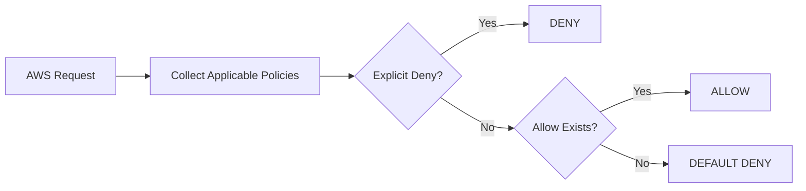

# AWS IAM – Policy Evaluation

## Introduction

AWS IAM evaluates policies to decide whether an AWS request should be **Allowed or Denied**.

```text
Request
   ↓
Collect Applicable Policies
   ↓
Evaluate Policies
   ↓
Allow / Deny
```

---

## How Policy Evaluation Works

When a request is made, AWS evaluates all applicable policies for that request.

Important policy types include:

* Identity-based policies
* Resource-based policies
* Permissions boundaries
* Session policies
* SCPs
* VPC endpoint policies

---

## Basic Evaluation Logic

```text
Is there an Explicit Deny?
        |
   Yes  ↓
      DENY

   No
        ↓
Is there an Allow?
        |
   Yes  ↓
      ALLOW

   No
        ↓
   DEFAULT DENY
```

### Golden Rule

```text
Explicit Deny > Allow > Default Deny
```

An **explicit Deny always overrides an Allow**.

---

## Example

Suppose a user has:

```text
Policy 1:
Allow s3:*

Policy 2:
Deny s3:DeleteObject
```

User tries:

```text
s3:DeleteObject
```

Final result:

```text
DENY
```

Because the explicit Deny overrides the Allow.

---

## Default Deny

If there is no policy that allows an action:

```text
No Allow
   ↓
Default Deny
   ↓
Access Denied
```

Example:

```text
User
 ↓
No s3:GetObject permission
 ↓
S3
 ↓
Access Denied
```

---

## Practical Example

User needs to read objects from S3.

Required permission:

```json
{
  "Effect": "Allow",
  "Action": "s3:GetObject",
  "Resource": "arn:aws:s3:::my-bucket/*"
}
```

If another applicable policy explicitly denies `s3:GetObject`, the final result is:

```text
DENY
```

---

## Policy Evaluation Flow



---

## Important Security Principle

Always follow:

```text
Least Privilege
      ↓
Only Required Permissions
      ↓
Reduce Unnecessary Access
```

Avoid giving:

```text
Action: "*"
Resource: "*"
```

unless genuinely required.

---

## Policy Simulator

AWS IAM Policy Simulator can be used to test whether a user, group, or role has permission to perform a specific action.

```text
IAM
 ↓
Policy Simulator
 ↓
Select Identity
 ↓
Select AWS Service
 ↓
Select Action
 ↓
Evaluate
 ↓
Allow / Deny
```

---

## Common Troubleshooting

If you receive:

```text
AccessDenied
```

Check:

```text
1. IAM Policy
2. Resource Policy
3. Explicit Deny
4. Permissions Boundary
5. SCP
6. Session Policy
7. Resource ARN
8. Required KMS permissions
```

---

## Interview Questions

### What is IAM Policy Evaluation?

It is the process AWS uses to determine whether a request should be allowed or denied.

### What happens when there is an Explicit Deny?

The request is denied even if another policy allows it.

### What is Default Deny?

If there is no applicable Allow, access is denied by default.

### What has higher priority: Allow or Explicit Deny?

**Explicit Deny.**

### Why is Policy Evaluation important in DevOps?

It helps troubleshoot permission issues and securely control access for EC2, S3, CI/CD pipelines, Terraform, and other AWS services.

---

## Quick Revision

```text
AWS Request
     ↓
Applicable Policies
     ↓
Explicit Deny?
 ┌───┴───┐
Yes      No
 ↓        ↓
DENY   Allow Exists?
          ↓
      ┌───┴───┐
     Yes      No
      ↓        ↓
    ALLOW   DEFAULT DENY
```

### Remember

```text
Explicit Deny
      ↓
   Overrides
      ↓
    Allow
      ↓
If no Allow
      ↓
 Default Deny
```


