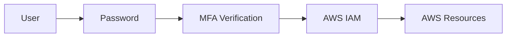
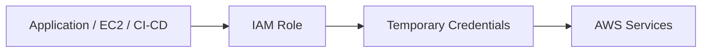
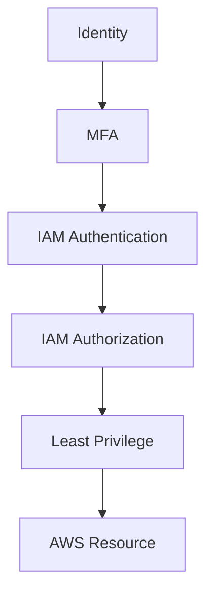

# AWS IAM – MFA and Security

## Introduction

MFA (Multi-Factor Authentication) adds an additional layer of security to AWS accounts and identities.

It requires more than one authentication factor before access is granted.

---

# MFA Architecture

```text id="1g3q6n"
User
  |
  v
Password
  +
MFA Code
  |
  v
AWS IAM
  |
  v
AWS Resources
```



---

# What is MFA?

MFA stands for **Multi-Factor Authentication**.

It combines:

```text id="3xj9qf"
Something you know
        +
Something you have
```

Example:

```text id="4h0r3w"
Password
   +
Authenticator Code
```

---

# Why MFA is Important?

MFA protects AWS accounts even if a password is compromised.

```text id="1t4y8n"
Password Stolen
      |
      v
MFA Required
      |
      v
Unauthorized Access Blocked
```

---

# MFA for Root User

AWS recommends enabling MFA on the **Root User**.

```text id="e7rj8k"
Root User
    |
    v
MFA Enabled
    |
    v
Additional Protection
```

The Root User should not be used for normal daily AWS operations.

---

# MFA for IAM Users

MFA can also be enabled for IAM users.

```text id="5j6m3v"
IAM User
    |
    +-- Password
    |
    +-- MFA
```

---

# Common MFA Options

Common AWS-supported MFA methods include:

```text id="l9p4af"
Virtual MFA Device
Hardware MFA Device
```

A virtual MFA device can be used with authenticator applications.

---

# Practical – Enable MFA

### Root User

```text id="k4w8b2"
AWS Console
→ Account
→ Security credentials
→ Multi-factor authentication
→ Assign MFA device
→ Scan QR Code
→ Enter MFA codes
→ Add MFA
```

### IAM User

```text id="5o3xj9"
IAM
→ Users
→ Select User
→ Security credentials
→ Assign MFA device
→ Configure MFA
```

---

# IAM Security Best Practices

```text id="6zy3s4"
✓ Enable MFA
✓ Use Least Privilege
✓ Avoid Root User for daily work
✓ Prefer IAM Roles
✓ Avoid unnecessary access keys
✓ Rotate credentials when required
✓ Review permissions regularly
✓ Monitor AWS account activity
```

---

# Access Keys

Access keys are used for programmatic access.

```text id="f6j8b2"
Access Key ID
      +
Secret Access Key
      ↓
AWS CLI / SDK
```

Do not hard-code access keys inside:

```text id="9j5b3e"
Source Code
GitHub
Docker Images
Application Files
```

---

# Better DevOps Approach

Instead of:

```text id="1w4x6h"
Application
    ↓
Hard-coded Access Key
    ↓
AWS
```

Prefer:



---

# Example – EC2 Security

```text id="n0g8p2"
EC2
 ↓
IAM Role
 ↓
Temporary Credentials
 ↓
S3
```

No permanent access key needs to be stored on the EC2 instance.

---

# Least Privilege

Give only the permissions required.

Bad:

```text id="8v5k3m"
Application
 ↓
AdministratorAccess
```

Better:

```text id="5q2j7a"
Application
 ↓
IAM Role
 ↓
s3:GetObject
 ↓
Specific Bucket
```

---

# IAM Security Flow



---

# Important Interview Questions

### What is MFA?

MFA provides an additional authentication factor along with the password.

### Why should MFA be enabled?

It provides additional protection if the password is compromised.

### Should the Root User be used daily?

No. The Root User should be protected and used only when required.

### What is an Access Key?

An access key is used for programmatic access to AWS through CLI, SDKs, and APIs.

### Why avoid hard-coded access keys?

They can be accidentally exposed through source code, GitHub, logs, or application files.

### What should be used instead of long-term credentials?

Use IAM Roles and temporary credentials wherever possible.

---

# Quick Revision

```text id="4x1h9a"
IAM Security
│
├── MFA
│   └── Additional Authentication
│
├── Least Privilege
│   └── Minimum Required Access
│
├── IAM Roles
│   └── Temporary Credentials
│
├── Access Key Security
│   └── Never Hard-code
│
└── Root User
    └── Avoid Daily Usage
```


