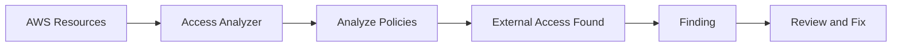
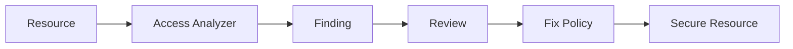
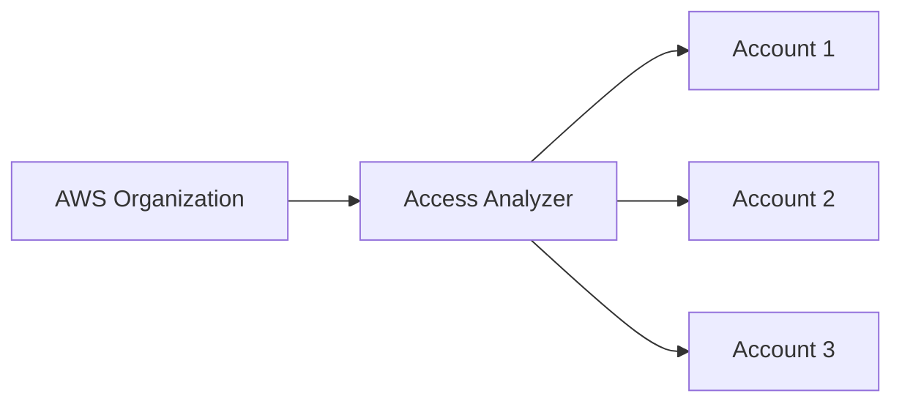

# AWS IAM – Access Analyzer

## Introduction

AWS IAM Access Analyzer helps identify AWS resources that are accessible from **outside the AWS account**, including public or cross-account access.

It helps detect unintended access and improve security.

---

# Basic Architecture

```text
AWS Resources
     |
     v
IAM Access Analyzer
     |
     v
Analyze External Access
     |
     v
Findings
     |
     v
Review & Fix
```

---

# What is IAM Access Analyzer?

Access Analyzer identifies resources that may be accessible by:

```text
Public Users
Other AWS Accounts
External Principals
```

It helps detect unintended resource sharing.

---

# How It Works



---

# Resources It Can Analyze

Access Analyzer can analyze resource policies for supported AWS resources such as:

```text
S3 Buckets
IAM Roles
KMS Keys
SQS Queues
SNS Topics
Lambda Functions
Secrets Manager Resources
VPC Endpoint Policies
```

---

# Types of Access

```text
Public Access
      ↓
Anyone outside the account

Cross-Account Access
      ↓
Another AWS Account

External Access
      ↓
External Principal / Entity
```

---

# Example – S3 Public Access

Suppose an S3 bucket policy allows:

```json
{
  "Effect": "Allow",
  "Principal": "*",
  "Action": "s3:GetObject",
  "Resource": "arn:aws:s3:::my-bucket/*"
}
```

Access Analyzer can identify this as potentially public access and generate a finding.

---

# Finding

A **finding** tells us that a resource has external access.

Example:

```text
Finding
│
├── Resource: S3 Bucket
├── Access: Public
├── Principal: *
└── Action: s3:GetObject
```

---

# Practical – Create Access Analyzer

```text
IAM
→ Access Analyzer
→ Create analyzer
→ Select Account or Organization
→ Select Region
→ Create analyzer
```

After creation, Access Analyzer starts analyzing supported resources and policies.

---

# View Findings

```text
IAM
→ Access Analyzer
→ Findings
→ Select Finding
→ Review Resource
→ Review External Access
```

---

# Finding Workflow



---

# How to Fix a Finding

Depending on the requirement:

```text
Remove Public Access
        OR
Restrict Principal
        OR
Modify Resource Policy
        OR
Remove Unnecessary Permissions
```

Example:

```text
Bad:
Principal = *

Better:
Principal = Specific AWS Account / Role
```

---

# Access Analyzer + AWS Organizations

Access Analyzer can also be used with AWS Organizations to help identify external access across multiple AWS accounts.



This is useful in larger DevOps environments.

---

# IAM Access Analyzer vs IAM Policy Simulator

| Access Analyzer                  | Policy Simulator           |
| -------------------------------- | -------------------------- |
| Finds external/unintended access | Tests permission decisions |
| Analyzes resource policies       | Simulates IAM policies     |
| Generates findings               | Shows Allow/Deny           |
| Security monitoring              | Permission troubleshooting |

---

# AWS CLI

List analyzers:

```bash
aws accessanalyzer list-analyzers
```

List findings:

```bash
aws accessanalyzer list-findings \
--analyzer-arn <ANALYZER-ARN>
```

Get a specific finding:

```bash
aws accessanalyzer get-finding \
--analyzer-arn <ANALYZER-ARN> \
--id <FINDING-ID>
```

---

# DevOps Use Case

Access Analyzer can help verify that application resources are not accidentally exposed.

```text
CI/CD
  |
  v
AWS Resources
  |
  v
Access Analyzer
  |
  v
Findings
  |
  v
Security Review
```

It can be part of a broader AWS security and governance process.

---

# Best Practices

* Review findings regularly.
* Remove unnecessary public access.
* Restrict cross-account access.
* Use specific principals instead of `*` when possible.
* Follow Least Privilege.
* Use Access Analyzer across AWS Organizations where appropriate.

---

# Important Interview Questions

### What is IAM Access Analyzer?

It identifies resources that are accessible from outside the AWS account and helps detect unintended external access.

### What is a Finding?

A finding is a result showing that a supported resource may be accessible by an external principal.

### Can Access Analyzer detect public S3 access?

Yes, for supported resource-policy configurations it can identify public access.

### Access Analyzer vs Policy Simulator?

Access Analyzer helps identify external access, while Policy Simulator tests how policies evaluate for specific actions.

### Why is Access Analyzer useful in DevOps?

It helps identify unintended resource exposure and supports secure AWS account and application management.

---

# Quick Revision

```text
IAM Access Analyzer
        |
        v
Analyze Resources
        |
        v
Detect External Access
        |
        v
Generate Finding
        |
        v
Review
        |
        v
Fix Policy
        |
        v
Better Security
```

